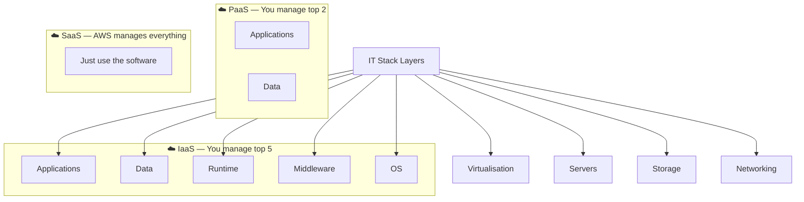
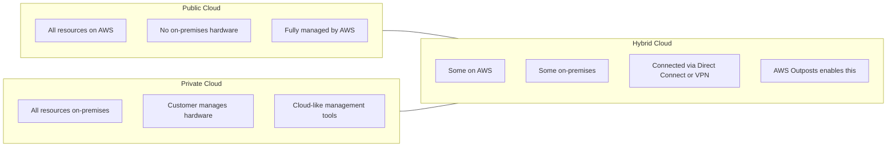
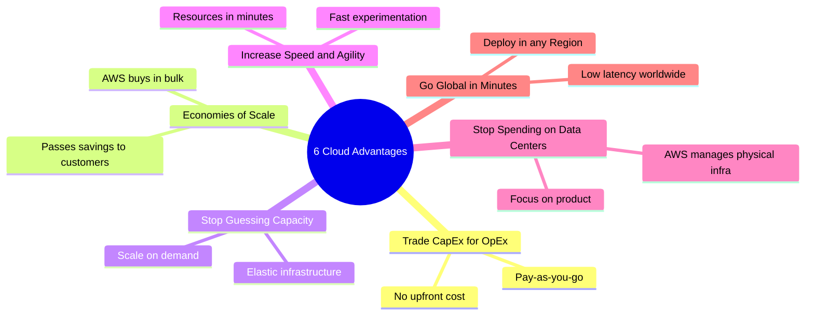
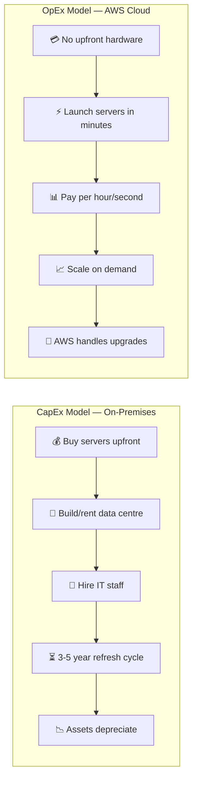
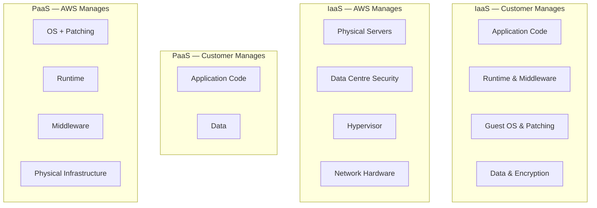

# Cloud Computing — Concepts, Models & Advantages

> **Exam:** AWS Certified Cloud Practitioner (CLF-C02)
> **Domain:** Cloud Concepts (24% of exam)
> **Chapter:** 01 — Cloud Concepts
> **Topics:** Cloud definition, Service Models, Deployment Models, 6 Advantages, CapEx vs OpEx

---

## Learning Objectives

After reading this chapter you will be able to:
- Define cloud computing using the standard NIST definition
- Distinguish between IaaS, PaaS, and SaaS with AWS examples
- Identify the correct deployment model for a given business requirement
- List and apply all 6 advantages of cloud computing in scenario questions
- Explain the difference between Capital Expenditure and Operational Expenditure

---

## 1. What Is Cloud Computing?

Cloud computing is the **on-demand delivery of IT resources over the internet with pay-as-you-go pricing**.

Instead of buying, owning, and maintaining physical data centers and servers, organisations access technology services — such as computing power, storage, and databases — on an as-needed basis from a cloud provider like Amazon Web Services (AWS).

The **NIST definition** identifies five essential characteristics of cloud:

| Characteristic | Meaning |
|---|---|
| **On-demand self-service** | Provision resources without human interaction from the provider |
| **Broad network access** | Available over the network from standard devices |
| **Resource pooling** | Provider serves multiple customers from shared resources |
| **Rapid elasticity** | Scale up or down quickly, often automatically |
| **Measured service** | Usage is metered and billed on consumption |

---

## 2. Cloud Service Models

There are three primary service models. The key difference is **how much you manage vs how much AWS manages**.

### 2.1 Infrastructure as a Service (IaaS)

AWS provides raw infrastructure. You control the operating system and everything above it.

| Aspect | Detail |
|---|---|
| **You manage** | OS, runtime, middleware, applications, data |
| **AWS manages** | Hypervisor, physical servers, storage, networking, data centre |
| **AWS Examples** | Amazon EC2, Amazon VPC, Amazon EBS |
| **Best for** | Lift-and-shift migrations, full OS control needed |
| **Analogy** | Renting an empty flat — you furnish and maintain the inside |

### 2.2 Platform as a Service (PaaS)

AWS manages the platform. You deploy code and manage data only.

| Aspect | Detail |
|---|---|
| **You manage** | Applications, data |
| **AWS manages** | OS, runtime, middleware, infrastructure |
| **AWS Examples** | AWS Elastic Beanstalk, AWS Lambda (partially), Amazon RDS |
| **Best for** | Developers who want to focus on code, not servers |
| **Analogy** | Renting a fully furnished service apartment |

### 2.3 Software as a Service (SaaS)

AWS or a vendor provides a complete application. You just use it.

| Aspect | Detail |
|---|---|
| **You manage** | Your data only |
| **AWS manages** | Everything else |
| **AWS Examples** | Amazon WorkMail, Amazon Chime, products from AWS Marketplace |
| **Best for** | End users who need ready-to-use software |
| **Analogy** | Using Gmail — no server knowledge required |

---

## 3. Cloud Deployment Models

### Deployment Model Comparison

| Model | Infrastructure Owner | Use Case | AWS Solution |
|---|---|---|---|
| **Public Cloud** | AWS | Startups, web apps, modern workloads | Standard AWS services |
| **Private Cloud** | Customer | Banks, defence, strict compliance | On-premises managed software |
| **Hybrid Cloud** | Both | Compliance + cloud flexibility needed | **AWS Outposts** |
| **Multi-Cloud** | Multiple providers | Avoid vendor lock-in | AWS + Azure + GCP together |

**Exam Tip:** When a question says *"company must keep some workloads on-premises due to compliance but wants to use AWS for others"* → answer is **Hybrid Cloud using AWS Outposts**.

---

## 4. The 6 Advantages of Cloud Computing

AWS officially defines 6 advantages. **These are directly tested.** Know all 6 precisely.

### 4.1 Trade Capital Expense for Variable Expense

Instead of investing heavily in data centres and servers before you know how you are going to use them, you can pay only when you consume computing resources and pay only for how much you consume.

**CapEx vs OpEx breakdown:**

| Dimension | CapEx (On-Premises) | OpEx (Cloud) |
|---|---|---|
| **Payment timing** | Large upfront investment | Pay as you use |
| **Budget planning** | 3–5 year hardware cycles | Monthly variable bills |
| **Risk** | Over/under provisioning | Pay exact usage |
| **Accounting** | Capitalised on balance sheet | Operating expense |
| **Exam keyword** | "Reduce upfront costs" | "Variable expense" |

### 4.2 Benefit from Massive Economies of Scale

Because usage from hundreds of thousands of customers is aggregated in the cloud, providers like AWS can achieve higher economies of scale — which translates to lower pay-as-you-go prices.

**Exam keyword:** *"AWS achieves lower pricing by aggregating usage across many customers"* → **Economies of Scale**

### 4.3 Stop Guessing Capacity

Eliminate guessing on your infrastructure capacity needs. When you make a capacity decision prior to deploying an application, you often end up either sitting on expensive idle resources or dealing with limited capacity.

**Exam keyword:** *"Seasonal traffic," "unpredictable demand," "elastic scaling"* → **Stop guessing capacity**

### 4.4 Increase Speed and Agility

In a cloud computing environment, new IT resources are only a click away — which means that you reduce the time to make those resources available to your developers from weeks to minutes.

**Exam keyword:** *"Faster time to market," "rapid provisioning," "launch in minutes"* → **Increase speed and agility**

### 4.5 Stop Spending Money on Running and Maintaining Data Centres

Focus on projects that differentiate your business, not the infrastructure. Let AWS manage the heavy lifting of racking, stacking, and powering servers.

**Exam keyword:** *"Eliminate data centre management costs"* → **Stop spending on data centres**

### 4.6 Go Global in Minutes

Easily deploy your application in multiple AWS Regions around the world with just a few clicks. This means you can provide lower latency and a better experience for your customers at minimal cost.

**Exam keyword:** *"Deploy worldwide," "serve international users," "low latency globally"* → **Go Global in minutes**

---

## 5. CapEx vs OpEx — Deep Dive

---

## 6. Elasticity vs Scalability

These two terms are closely related but differ in an important way:

| Concept | Definition | Direction | AWS Mechanism |
|---|---|---|---|
| **Scalability** | Ability to handle growing load by adding resources | Scale Up (vertical) or Scale Out (horizontal) | EC2 instance resizing, adding instances |
| **Elasticity** | Ability to scale automatically based on real-time demand | Both Up and Down, automatically | EC2 Auto Scaling Groups |

**Key Difference:** Scalability is the *capability*. Elasticity is *automated* scalability that also scales back down when demand drops.

---

## 7. Exam Focus Points

| Topic | What the Exam Tests | Correct Answer Pattern |
|---|---|---|
| Reduce upfront costs | Which cloud advantage | Trade CapEx for OpEx |
| Economies of scale | Why AWS prices drop | Aggregated usage = lower prices |
| Seasonal traffic | Which advantage eliminates over-provisioning | Stop guessing capacity |
| Launch new features fast | Which advantage | Increase speed and agility |
| Global deployment | Which advantage | Go global in minutes |
| On-premises + AWS | Which deployment model | Hybrid using Outposts |
| Just upload code | Which service model | PaaS |
| Full OS control | Which service model | IaaS |

---

## 8. Commonly Confused Concepts

### Public Cloud vs Hybrid Cloud vs Private Cloud

| If the question says... | Answer is |
|---|---|
| "Company uses only AWS" | Public Cloud |
| "Company must keep data on-premises but wants cloud features" | Hybrid Cloud |
| "Company runs all IT in their own data centre with cloud-like tools" | Private Cloud |
| "Company uses AWS and Azure together" | Multi-Cloud |

### IaaS vs PaaS — Shared Responsibility Boundary

---

## 9. Quick Revision Points

- Cloud = on-demand IT resources over internet with pay-as-you-go pricing
- **IaaS** = you manage OS and above → EC2
- **PaaS** = you manage code and data only → Elastic Beanstalk
- **SaaS** = you just use it → WorkMail
- **Public Cloud** = everything on AWS
- **Hybrid Cloud** = on-premises + AWS → enabled by **AWS Outposts**
- **6 Advantages:** Trade CapEx, Economies of Scale, Stop Guessing Capacity, Speed & Agility, Stop Spending on DC, Go Global
- **CapEx** = upfront fixed cost; **OpEx** = ongoing variable cost
- Cloud converts CapEx to OpEx — this is the primary financial benefit
- **Elasticity** = automatic scale up AND down; **Scalability** = ability to handle more load

---

*Next Chapter → `02-aws-global-infrastructure/regions-and-availability-zones.md`*
