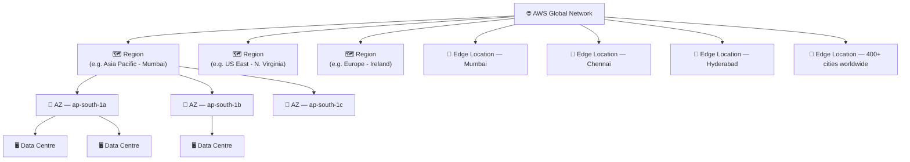
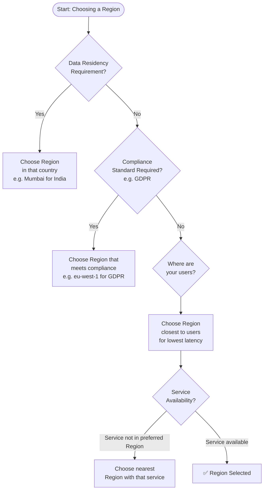
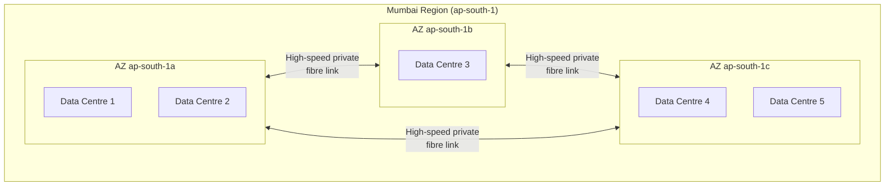
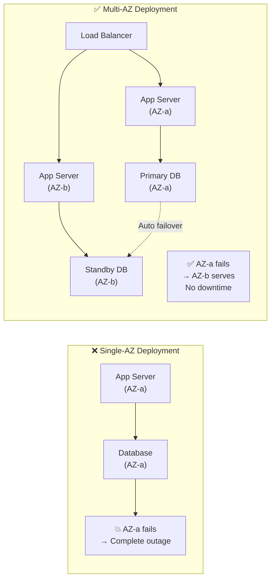
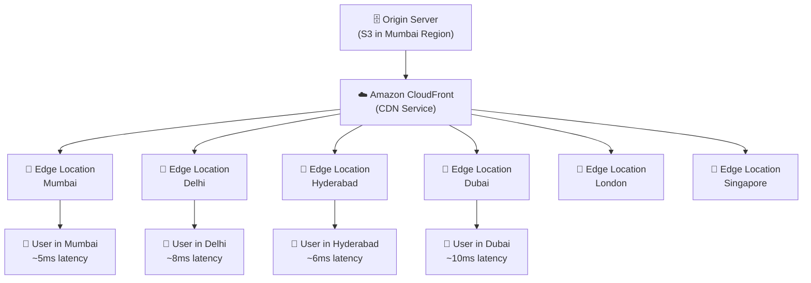
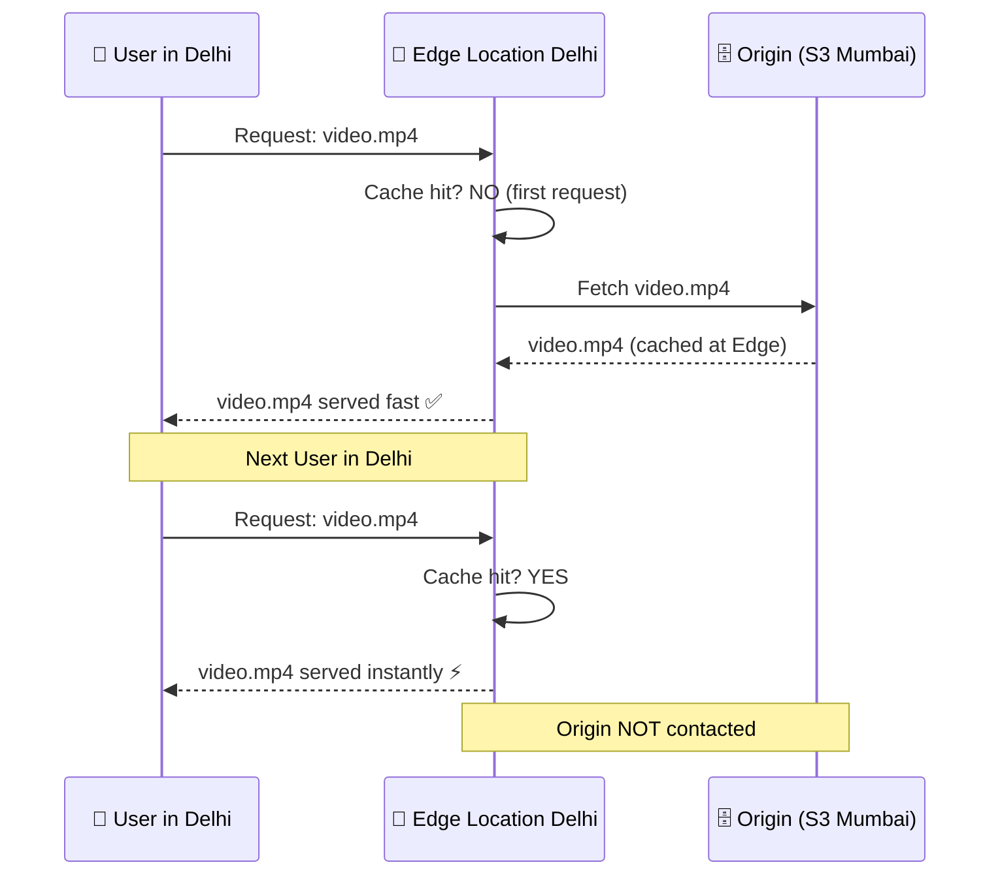
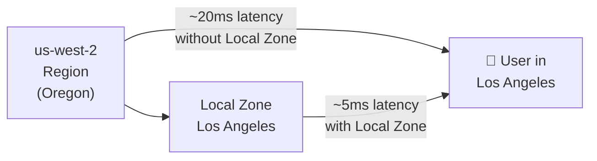
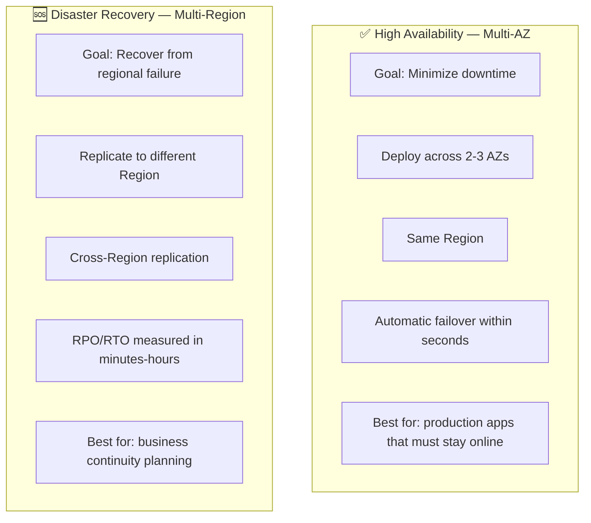
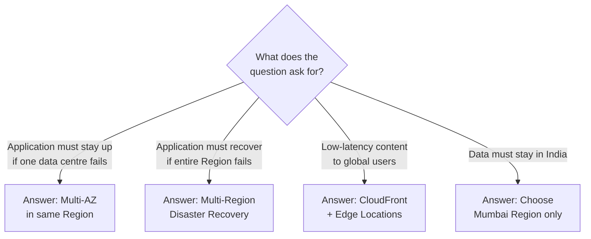

# AWS Global Infrastructure — Regions, AZs & Edge Locations

> **Exam:** AWS Certified Cloud Practitioner (CLF-C02)
> **Domain:** Cloud Technology and Services (34% of exam)
> **Chapter:** 02 — AWS Global Infrastructure
> **Topics:** Regions, Availability Zones, Edge Locations, Local Zones, CloudFront, High Availability vs Disaster Recovery

---

## Learning Objectives

After reading this chapter you will be able to:
- Explain the three-tier AWS global infrastructure hierarchy
- Distinguish between Regions, Availability Zones, and Edge Locations
- Identify which infrastructure layer is used for high availability vs disaster recovery
- Explain how Amazon CloudFront uses Edge Locations
- Choose the correct AWS Region for a given compliance or latency requirement

---

## 1. AWS Global Infrastructure Overview

AWS operates the world's largest cloud infrastructure — spanning continents, countries, and cities through a layered architecture.



### Infrastructure Counts (approximate, grows regularly)

| Layer | Count | Purpose |
|---|---|---|
| **Regions** | 33+ | Where you deploy applications and store data |
| **Availability Zones** | 105+ (3+ per Region) | High availability and fault isolation |
| **Edge Locations** | 400+ | Content delivery and DNS caching |
| **Local Zones** | 30+ | Ultra-low latency for specific cities |

---

## 2. AWS Regions

### 2.1 Definition

An AWS Region is a **physical geographic area** in the world that contains multiple, isolated Availability Zones. Each Region is completely independent of all other Regions — there is no automatic cross-Region data sharing.

### 2.2 Key Region Properties

| Property | Detail |
|---|---|
| **Independence** | Fully isolated from all other Regions |
| **Minimum AZs** | Every Region has at least 3 AZs |
| **Data sovereignty** | Data in a Region stays in that Region unless you explicitly replicate it |
| **Service availability** | Not all services are available in all Regions |
| **Latency** | Choose Region closest to your users |

### 2.3 How to Choose a Region



### 2.4 Key AWS Regions — India Context

| Region Code | Location | Common Use Case |
|---|---|---|
| `ap-south-1` | Mumbai | Indian users, data residency compliance |
| `ap-south-2` | Hyderabad | Additional India Region (newer) |
| `ap-southeast-1` | Singapore | Southeast Asia users |
| `us-east-1` | N. Virginia | Most services launch here first, US East users |

### 2.5 Exam Points — Regions

- ✅ Data does **NOT** automatically cross Regions — you must configure cross-region replication
- ✅ "Data must stay in India" → deploy in `ap-south-1` (Mumbai)
- ✅ Not all AWS services are available in every Region — `us-east-1` typically gets new services first
- ✅ Region selection affects: **latency**, **compliance**, **service availability**, **cost** (prices vary by Region)

---

## 3. Availability Zones (AZs)

### 3.1 Definition

An Availability Zone is one or more **discrete, physically separate data centres** within an AWS Region, each with:
- Redundant power supply
- Independent cooling systems
- Separate network connectivity
- Physical separation from other AZs (typically kilometers apart)

### 3.2 AZ Architecture



### 3.3 Why Multiple AZs Matter



### 3.4 AZ Key Facts

| Property | Detail |
|---|---|
| **Physical separation** | Separate buildings, power grids, flood zones |
| **Connectivity** | Connected via high-speed, private fibre optic |
| **Latency between AZs** | Single-digit milliseconds (fast enough for synchronous replication) |
| **AZ naming** | Each AZ has a code: `ap-south-1a`, `ap-south-1b`, `ap-south-1c` |
| **AZ = physical location** | AZ names are randomised per account — your `ap-south-1a` may not be the same physical location as someone else's `ap-south-1a` |

### 3.5 Exam Points — AZs

- ✅ **Multi-AZ = High Availability** — application survives one AZ failure
- ✅ AZs within a Region are connected by high-speed private links — fast enough for real-time replication
- ✅ Deploy across **minimum 2 AZs** for any production workload
- ✅ Amazon RDS Multi-AZ automatically replicates to a standby in a different AZ

---

## 4. Edge Locations

### 4.1 Definition

Edge Locations are **small AWS points of presence (PoPs)** deployed in hundreds of cities worldwide, specifically to deliver content and DNS resolution to end users with minimal latency.

**Important distinction:**
- Regions and AZs → where you **run** your applications
- Edge Locations → where AWS **delivers your content** to users

### 4.2 Edge Location Architecture



### 4.3 What Runs at Edge Locations

| Service | What It Does at Edge |
|---|---|
| **Amazon CloudFront** | Caches website content, images, videos near users |
| **Amazon Route 53** | Resolves DNS queries from the nearest Edge Location |
| **AWS Shield** | DDoS protection at the Edge Layer |
| **AWS WAF** (with CloudFront) | Blocks web attacks at the Edge before reaching origin |

### 4.4 How CloudFront Cache Works



### 4.5 Exam Points — Edge Locations

- ✅ There are **400+ Edge Locations** — far more than Regions (33+)
- ✅ Edge Locations are used by **CloudFront** and **Route 53**
- ✅ Edge Locations are **NOT** where you deploy EC2 or databases
- ✅ "Deliver content globally with low latency" → **CloudFront + Edge Locations**
- ✅ Edge Locations exist in cities that don't have full Regions (e.g., Delhi, Hyderabad, Kolkata)

---

## 5. Local Zones and Wavelength Zones

### 5.1 Local Zones

Local Zones are **extensions of AWS Regions** placed in large metropolitan areas — closer to densely populated centres than the nearest Region.



| Property | Detail |
|---|---|
| **Purpose** | Single-digit millisecond latency for specific cities |
| **Services available** | EC2, EBS, RDS, ECS (subset of services) |
| **Use cases** | Gaming, media rendering, real-time simulations |
| **Relationship to Region** | Extension of parent Region, not a separate Region |

### 5.2 Wavelength Zones

Wavelength Zones embed AWS compute and storage services within 5G network providers' data centres.

| Property | Detail |
|---|---|
| **Purpose** | Ultra-low latency applications using 5G mobile networks |
| **Use cases** | AR/VR, connected vehicles, IoT |
| **Exam relevance** | Low — understand what it is, rarely tested at CCP level |

---

## 6. High Availability vs Disaster Recovery

This comparison is heavily tested. Understanding the difference determines whether the answer uses AZs or Regions.



### Comparison Table

| Dimension | High Availability | Disaster Recovery |
|---|---|---|
| **Scope** | Within one Region (multiple AZs) | Across multiple Regions |
| **Failure handled** | Single data centre / AZ failure | Entire Region failure |
| **Failover time** | Seconds to minutes | Minutes to hours |
| **Cost** | Moderate (same-region replication) | Higher (cross-region replication) |
| **AWS Services** | ELB, Auto Scaling, RDS Multi-AZ | S3 Cross-Region Replication, Route 53 failover |

### Exam Decision Guide



---

## 7. Infrastructure Comparison Summary

```
AWS Global Infrastructure Hierarchy:
━━━━━━━━━━━━━━━━━━━━━━━━━━━━━━━━━━━━━━━━━━━━━━━

🌐 AWS Global Network (backbone)
│
├── 🗺️  REGION (33+ worldwide)
│    ├── Geographically isolated
│    ├── 3+ AZs minimum
│    └── Independent from other Regions
│
│    └── 🏢 AVAILABILITY ZONE (105+ worldwide)
│         ├── 1+ physical data centres
│         ├── Independent power + network
│         ├── Connected to other AZs via private fibre
│         └── Used for High Availability
│
├── 📡 EDGE LOCATION (400+ worldwide)
│    ├── Not for running apps
│    ├── Used by CloudFront for caching
│    ├── Used by Route 53 for DNS
│    └── Exists in many cities without a Region
│
└── 🏙️ LOCAL ZONE (30+ worldwide)
     ├── Extension of a Region
     ├── Subset of AWS services
     └── Ultra-low latency for specific cities
━━━━━━━━━━━━━━━━━━━━━━━━━━━━━━━━━━━━━━━━━━━━━━━
```

---

## 8. Exam Focus Points

| Scenario Keyword | Correct Answer |
|---|---|
| "High availability," "survive AZ failure" | Multi-AZ deployment |
| "Disaster recovery," "survive Region failure" | Multi-Region deployment |
| "Low latency content delivery globally" | Amazon CloudFront + Edge Locations |
| "Data must remain in India" | Deploy only in Mumbai Region |
| "Ultra-low latency for one city" | AWS Local Zone |
| "Identify CPU utilization across multiple AZs" | Amazon CloudWatch |
| "DNS routing and health checks" | Amazon Route 53 |

---

## 9. Quick Revision Points

- **Region** = geographic area, 33+, min 3 AZs each, fully independent
- **AZ** = isolated data centre(s) within a Region, 105+ total
- **Edge Location** = 400+ cities, content caching, CloudFront + Route 53
- **Local Zone** = extension of Region, ultra-low latency for specific cities
- Multi-AZ = **High Availability** (milliseconds failover)
- Multi-Region = **Disaster Recovery** (minutes-hours recovery)
- Data does NOT cross Regions automatically
- AZs within a Region are connected by high-speed private fibre
- CloudFront caches content at Edge Locations near users
- `ap-south-1` = Mumbai Region (primary India Region)

---

*Previous Chapter → `01-cloud-concepts/what-is-cloud.md`*
*Next Chapter → `03-core-services/compute/ec2-basics.md`*
