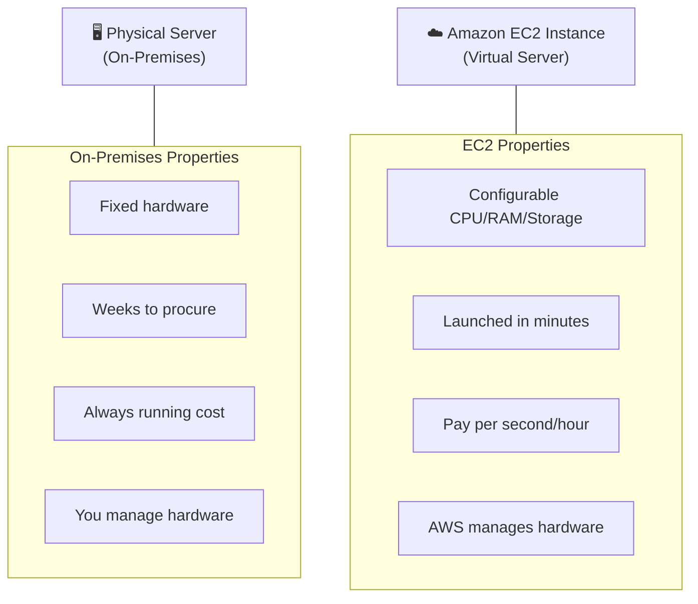
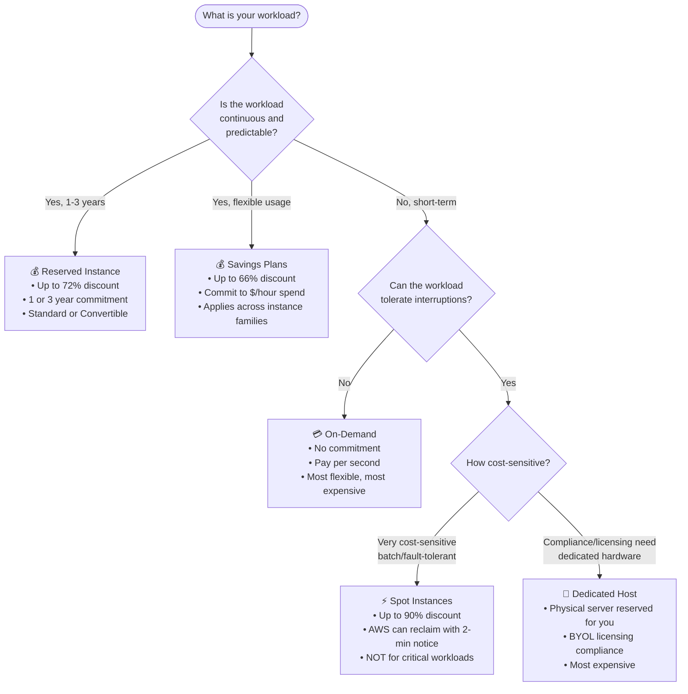
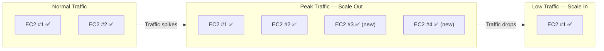
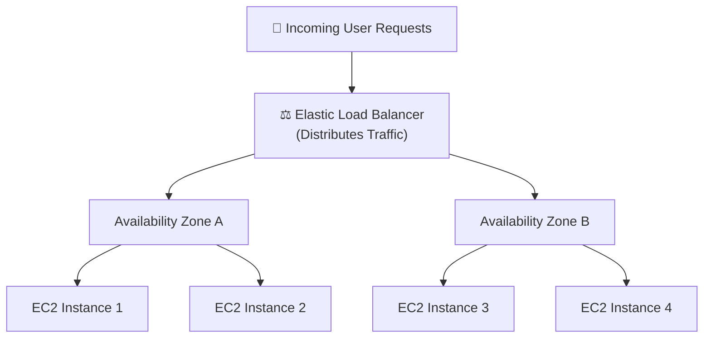
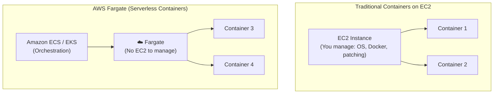
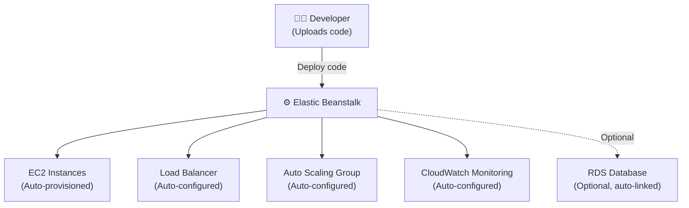

# AWS Compute Services — EC2, Lambda, Fargate & Elastic Beanstalk

> **Exam:** AWS Certified Cloud Practitioner (CLF-C02)
> **Domain:** Cloud Technology and Services (34% of exam)
> **Chapter:** 03a — Core Services: Compute
> **Topics:** EC2 instance types, purchase options, Lambda, Fargate, Elastic Beanstalk, Auto Scaling, ELB

---

## Learning Objectives

After reading this chapter you will be able to:
- Describe what Amazon EC2 is and how it differs from physical servers
- Choose the correct EC2 purchase option for a given workload description
- Distinguish between EC2, Lambda, Fargate, and Elastic Beanstalk
- Explain horizontal vs vertical scaling and when to use each
- Describe how Auto Scaling and Elastic Load Balancing work together

---

## 1. Amazon EC2 — Elastic Compute Cloud

### 1.1 What Is EC2?

Amazon EC2 provides resizable **virtual machines (instances)** in the AWS cloud. It is the most fundamental compute service and forms the backbone of most AWS architectures.



### 1.2 EC2 Instance Families

AWS groups EC2 instances into families optimised for different workloads:

| Family | Optimised For | Example Use Case | Instance Types |
|---|---|---|---|
| **General Purpose** | Balanced CPU, memory, networking | Web servers, dev environments | t3, t4g, m6i, m7g |
| **Compute Optimised** | High CPU performance | Batch processing, HPC, gaming | c6i, c7g |
| **Memory Optimised** | Large in-memory datasets | In-memory databases, real-time analytics | r6i, x2idn |
| **Storage Optimised** | High sequential read/write | Data warehousing, distributed file systems | i3, d3 |
| **Accelerated Computing** | GPU/ML workloads | Machine learning, graphics rendering | p4, g5, inf2 |

**Exam Note:** The CCP exam does **not** test specific instance type names. It tests which *family* fits a described workload.

---

## 2. EC2 Purchase Options

This is one of the most tested topics at the CCP level. Each option has a distinct use case.



### 2.1 Detailed Purchase Option Comparison

| Purchase Option | Discount vs On-Demand | Commitment | Interruption Risk | Best For |
|---|---|---|---|---|
| **On-Demand** | 0% (baseline price) | None | None | Short-term, unpredictable, testing |
| **Reserved (1 yr)** | Up to 40% | 1 year | None | Steady, predictable workloads |
| **Reserved (3 yr)** | Up to 72% | 3 years | None | Very stable, long-term workloads |
| **Savings Plans** | Up to 66% | 1 or 3 year ($/hr commit) | None | Flexible long-term with family changes |
| **Spot** | Up to 90% | None | High (2-min warning) | Batch jobs, fault-tolerant apps |
| **Dedicated Host** | Variable (can use RI) | Optional | None | Compliance, BYOL licensing |
| **Dedicated Instance** | Premium pricing | None | None | Single-tenant hardware requirement |

### 2.2 Payment Options for Reserved Instances

| Payment Type | Discount Level | Cash Flow Impact |
|---|---|---|
| **All Upfront** | Highest discount | Large one-time payment |
| **Partial Upfront** | Medium discount | Down payment + monthly |
| **No Upfront** | Lowest discount | Monthly only, no commitment fee |

**Exam Tip:** "All Upfront + Standard Reserved Instance" = **maximum possible discount** for a steady, known workload.

---

## 3. EC2 Auto Scaling

Auto Scaling automatically adds or removes EC2 instances based on demand. It ensures you always have the right amount of compute capacity.



### 3.1 Scaling Types

| Scaling Type | Description | Direction | AWS Mechanism |
|---|---|---|---|
| **Vertical Scaling** | Increase instance size (more CPU/RAM) | Up only | Change instance type (requires restart) |
| **Horizontal Scaling** | Add more instances | Out (add) / In (remove) | EC2 Auto Scaling Groups |
| **Predictive Scaling** | Scale ahead of known events using ML | Proactive | Auto Scaling predictive policies |

**Best Practice:** Always prefer **horizontal scaling** (add more instances) over vertical scaling for high availability — horizontal scaling distributes across multiple AZs.

---

## 4. Elastic Load Balancer (ELB)

ELB distributes incoming traffic across multiple EC2 instances, ensuring no single instance is overwhelmed.



### 4.1 ELB Types

| ELB Type | Layer | Protocol | Use Case |
|---|---|---|---|
| **Application LB (ALB)** | Layer 7 (HTTP/HTTPS) | HTTP, HTTPS | Web applications, microservices, path-based routing |
| **Network LB (NLB)** | Layer 4 (TCP/UDP) | TCP, UDP, TLS | High-performance, ultra-low latency, gaming |
| **Gateway LB (GLB)** | Layer 3 | IP | Third-party security appliances |

**Exam Tip:** CCP exam typically only requires knowing that ELB distributes traffic across instances and AZs. ALB vs NLB differences are more relevant to the Solutions Architect exam.

---

## 5. AWS Lambda

### 5.1 What Is Lambda?

Lambda is AWS's **serverless compute service**. You write code, define a trigger, and Lambda runs the code — with no server provisioning, no OS management, and no capacity planning.

```mermaid
graph LR
    subgraph TRIGGERS["⚡ Triggers (Events)"]
        T1["HTTP Request\n(API Gateway)"]
        T2["File Upload\n(S3 Event)"]
        T3["Scheduled Time\n(EventBridge)"]
        T4["Database Change\n(DynamoDB Stream)"]
        T5["Message in Queue\n(SQS)"]
    end

    subgraph LAMBDA["☁️ AWS Lambda"]
        L1["Your Code Runs"]
        L2["Auto-scales from\n0 to thousands"]
        L3["Pay per millisecond\nof execution"]
    end

    subgraph OUTPUT["📤 Output"]
        O1["Write to DynamoDB"]
        O2["Send SNS notification"]
        O3["Return HTTP response"]
        O4["Store in S3"]
    end

    TRIGGERS --> LAMBDA --> OUTPUT
```



### 5.2 Lambda Key Properties

| Property | Detail |
|---|---|
| **Execution model** | Event-driven, runs only when triggered |
| **Timeout** | Maximum 15 minutes per invocation |
| **Pricing** | Per request count + duration (GB-seconds) |
| **Scaling** | Automatic, from 0 to thousands of concurrent executions |
| **OS management** | None required — AWS manages everything |
| **Languages** | Python, Node.js, Java, Go, Ruby, .NET, custom runtimes |

### 5.3 Lambda vs EC2 — When to Use Which

| Consideration | Use EC2 | Use Lambda |
|---|---|---|
| **Workload duration** | Long-running (hours/days) | Short tasks (< 15 minutes) |
| **Control needed** | Full OS and middleware control | Just code execution |
| **Traffic pattern** | Steady, continuous | Sporadic, event-driven |
| **Pricing model** | Per hour (even when idle) | Per execution (zero cost when idle) |
| **Scaling speed** | Minutes (via Auto Scaling) | Milliseconds (instant) |
| **State** | Stateful workloads possible | Stateless by design |

---

## 6. AWS Fargate

### 6.1 What Is Fargate?

Fargate is a **serverless compute engine for containers**. It works with Amazon ECS (Elastic Container Service) and Amazon EKS (Elastic Kubernetes Service) to run containers without managing the underlying EC2 instances.



### 6.2 Fargate vs EC2 Launch Type

| Dimension | EC2 Launch Type | Fargate Launch Type |
|---|---|---|
| **Server management** | You manage EC2 instances | AWS manages servers |
| **Scaling** | Must manage EC2 capacity | Automatic, serverless |
| **Pricing** | Pay for EC2 instances (running or not) | Pay per vCPU/memory per container |
| **Patching** | You patch the host OS | AWS patches everything |
| **Visibility** | Full access to host | No access to underlying host |
| **Use case** | When you need specific EC2 configs | When you want to just run containers |

**Exam Tip:** If a question asks about removing the need to manage Docker hosts, EC2 patching, or cluster management → **AWS Fargate**

---

## 7. AWS Elastic Beanstalk

### 7.1 What Is Elastic Beanstalk?

Elastic Beanstalk is a **Platform as a Service (PaaS)** that simplifies application deployment. You provide your application code, and Elastic Beanstalk automatically handles:
- Provisioning EC2 instances
- Configuring load balancers
- Setting up Auto Scaling
- Monitoring health
- Software updates



### 7.2 Elastic Beanstalk Key Properties

| Property | Detail |
|---|---|
| **Supported platforms** | Java, .NET, PHP, Node.js, Python, Ruby, Go, Docker |
| **Control** | You still have full access to underlying EC2 resources |
| **Cost** | No extra charge for Beanstalk — pay only for EC2, RDS, ELB resources it provisions |
| **Deployment types** | All at once, Rolling, Rolling with additional batch, Immutable, Blue/Green |
| **Best for** | Web apps, APIs, microservices — without wanting to manage infrastructure |

---

## 8. Compute Services — Full Comparison Matrix

```
╔══════════════════╦══════════════╦══════════════╦══════════════╦══════════════╗
║    Property      ║     EC2      ║    Lambda    ║   Fargate    ║  Beanstalk   ║
╠══════════════════╬══════════════╬══════════════╬══════════════╬══════════════╣
║ Server Mgmt      ║ You manage   ║ None         ║ None         ║ AWS manages  ║
║ Scaling          ║ Auto Scaling ║ Automatic    ║ Automatic    ║ Auto Scaling ║
║ Container?       ║ Optional     ║ No           ║ Yes (required║ Optional     ║
║ Max run time     ║ Unlimited    ║ 15 minutes   ║ Unlimited    ║ Unlimited    ║
║ OS patching      ║ You do it    ║ AWS does it  ║ AWS does it  ║ You do it    ║
║ Billing unit     ║ Per second   ║ Per ms       ║ Per vCPU/mem ║ Per resource ║
║ Service model    ║ IaaS         ║ Serverless   ║ Serverless   ║ PaaS         ║
║ Idle cost        ║ Yes          ║ Zero         ║ Zero (if off)║ Yes          ║
╚══════════════════╩══════════════╩══════════════╩══════════════╩══════════════╝
```

---

## 9. Other Compute Services (Know These Exist)

| Service | What It Does | Exam Relevance |
|---|---|---|
| **Amazon ECS** | Container orchestration service using Docker | Know it orchestrates containers; Fargate is its serverless mode |
| **Amazon EKS** | Managed Kubernetes service | Know it is managed Kubernetes; appears in migration scenarios |
| **AWS Batch** | Managed batch computing at scale | For scientific/data workloads needing scheduled batch jobs |
| **Amazon Lightsail** | Simplified VPS with bundled pricing | For simple websites, blogs, small apps — predictable low cost |

---

## 10. Exam Focus Points

| Exam Scenario | Correct Service/Option |
|---|---|
| "Run code in response to events without servers" | AWS Lambda |
| "Uninterrupted workload, predictable, 1-3 years" | Standard Reserved Instance |
| "Cost-sensitive, batch job, can handle interruption" | Spot Instances |
| "Short-term, variable, no commitment" | On-Demand Instance |
| "Run containers without managing EC2 servers" | AWS Fargate |
| "Deploy web app, AWS handles infra provisioning" | AWS Elastic Beanstalk |
| "Add/remove servers automatically based on demand" | EC2 Auto Scaling |
| "Distribute traffic across multiple EC2 instances" | Elastic Load Balancer |
| "Maximum discount for long-term predictable EC2" | All Upfront Standard Reserved Instance |

---

## 11. Exam Traps

| Trap | Explanation |
|---|---|
| **Spot = unreliable** | Spot is great for batch, dev/test, fault-tolerant jobs. Never use for critical user-facing apps |
| **Beanstalk = no control** | Wrong. Beanstalk deploys on EC2 and you retain full access to underlying resources |
| **Lambda = always fastest** | Lambda has cold-start latency. Not always best for sub-millisecond consistent latency |
| **Fargate = no Kubernetes** | Wrong. Fargate supports both ECS and EKS |
| **Reserved = locked to one AZ** | Standard Reserved can be zonal or regional. Regional RIs give AZ flexibility |

---

## 12. Quick Revision Points

- **EC2** = virtual machines, you manage OS — IaaS
- **EC2 Purchase Options:** On-Demand (flexible) → Reserved (predictable discount) → Spot (cheapest, interruptible) → Dedicated Host (compliance/licensing)
- All Upfront + Standard Reserved = **maximum discount**
- **Lambda** = serverless, event-driven, pay per millisecond, max 15 min per invocation
- **Fargate** = serverless containers, no EC2 to manage
- **Elastic Beanstalk** = PaaS, upload code, AWS provisions and manages infrastructure
- **Auto Scaling** = automatically adds/removes EC2 based on demand
- **ELB** = distributes traffic across instances and AZs
- Prefer **horizontal scaling** (add instances) over vertical (resize) for HA
- Lambda and Fargate have **zero idle cost**; EC2 charges even when idle

---

*Previous Chapter → `02-aws-global-infrastructure/regions-and-availability-zones.md`*
*Next Chapter → `03-core-services/storage/s3-basics.md`*
