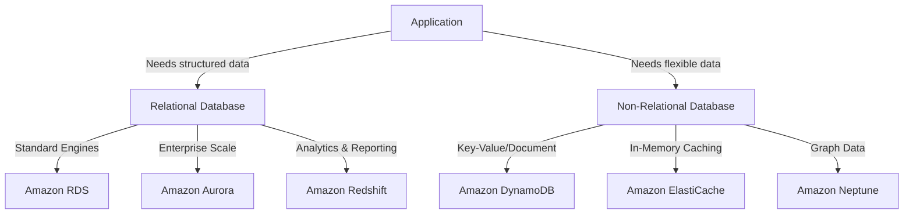
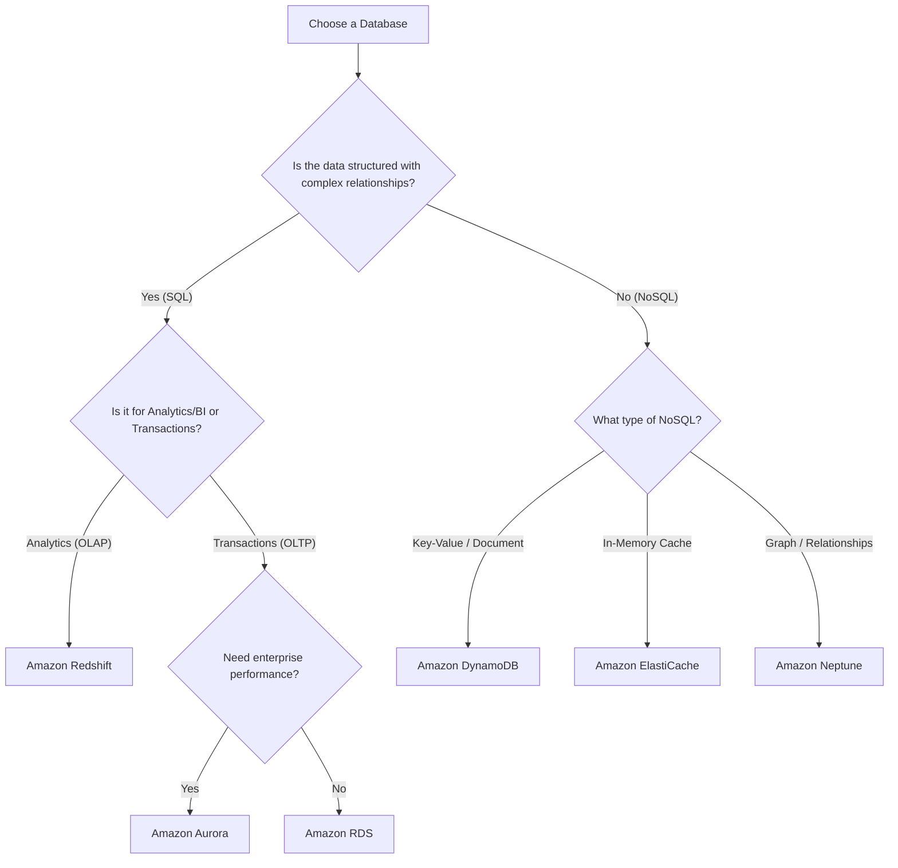

# AWS Database Services: RDS, DynamoDB, and More

> **Exam:** AWS Certified Cloud Practitioner (CLF-C02)
> **Domain:** 3.0 Cloud Technology and Services
> **Weight:** 34%
> **Difficulty:** Intermediate
> **Last Updated:** 2026-06

---

## 🎯 Learning Objectives
After reading this chapter, you will be able to:
1. Distinguish between Relational (SQL) and Non-Relational (NoSQL) databases.
2. Select the correct AWS database service based on application requirements.
3. Understand the use cases for Amazon RDS, Aurora, DynamoDB, Redshift, and ElastiCache.
4. Explain database migration tools like AWS DMS.

---

## 🏛️ Architecture Overview: Relational vs. Non-Relational

---

## 📘 Concept Definitions

### 1. Amazon RDS (Relational Database Service)
Amazon RDS is a managed service that makes it easy to set up, operate, and scale a relational database in the cloud. It automates time-consuming administration tasks such as hardware provisioning, database setup, patching, and backups.
- **Engines Supported:** PostgreSQL, MySQL, MariaDB, Oracle, SQL Server, and Amazon Aurora.
- **Use Case:** Traditional applications, ERP, CRM, and e-commerce platforms requiring complex joins and structured data.

### 2. Amazon Aurora
Amazon Aurora is a MySQL and PostgreSQL-compatible relational database built specifically for the cloud. It provides the performance and availability of commercial-grade databases at a fraction of the cost.
- **Architecture:** Storage is decoupled from compute and auto-scales up to 128 TiB.
- **Availability:** Replicates 6 copies of your data across 3 Availability Zones.

### 3. Amazon DynamoDB
Amazon DynamoDB is a fully managed, serverless, key-value and document database (NoSQL) designed to run high-performance applications at any scale.
- **Performance:** Provides single-digit millisecond latency.
- **Use Case:** Mobile backends, gaming leaderboards, IoT sensor data, and applications requiring flexible schemas.

### 4. Amazon Redshift
Amazon Redshift is a fully managed, petabyte-scale data warehouse service in the cloud.
- **Use Case:** Big data analytics, complex queries against large datasets, and business intelligence (BI) reporting.

### 5. Amazon ElastiCache
Amazon ElastiCache is a managed, in-memory caching service that accelerates application performance by retrieving data from fast, managed, in-memory caches instead of relying entirely on slower disk-based databases.
- **Engines:** Redis and Memcached.
- **Use Case:** Caching database queries, session management, and real-time analytics.

### 6. AWS DMS (Database Migration Service)
A service that helps you migrate databases to AWS securely and easily while the source database remains fully operational during the migration.

---

## ⚖️ Service Comparison Matrix

| Feature | Amazon RDS / Aurora | Amazon DynamoDB | Amazon Redshift |
|---------|--------------------|-----------------|-----------------|
| **Data Type** | Relational (SQL) | Non-Relational (NoSQL) | Relational Data Warehouse |
| **Schema** | Fixed / Rigid | Flexible (Key-Value) | Fixed (Columnar) |
| **Scaling** | Vertical (Compute) & Horizontal (Read Replicas) | Seamless Horizontal | Massive Parallel Processing (MPP) |
| **Best For** | Transactions (OLTP), complex queries | High-throughput, simple reads/writes | Analytics (OLAP), Business Intelligence |
| **Serverless**| Aurora Serverless available | Yes (Fully Serverless) | Redshift Serverless available |

---

## 🗺️ Decision Guide: Which Database to Choose?

---

## ⚡ Exam Focus Points

- ✅ **Keyword:** If you see "Data Warehouse", "BI", or "Analytics", the answer is **Amazon Redshift**.
- ✅ **Keyword:** If you see "Millisecond latency", "Key-Value", or "Serverless database", the answer is **Amazon DynamoDB**.
- ✅ **Keyword:** If you see "In-memory" or "Sub-millisecond latency", the answer is **Amazon ElastiCache**.
- ✅ **Aurora vs RDS:** Aurora is AWS's proprietary engine that is fully compatible with MySQL and PostgreSQL, offering much higher performance and automatic storage scaling compared to standard RDS.
- ✅ **DMS:** If the question mentions moving an on-premises database to AWS with minimal downtime, look for **AWS Database Migration Service**.

---

## 📝 Quick Revision
- **RDS:** Standard relational database (MySQL, PostgreSQL, etc.).
- **Aurora:** AWS-optimized relational database, high performance, replicates across 3 AZs.
- **DynamoDB:** NoSQL, key-value, serverless, highly scalable.
- **Redshift:** Data warehousing for analytics.
- **ElastiCache:** In-memory cache for speed (Redis/Memcached).
- **DMS:** Database migration without downtime.
