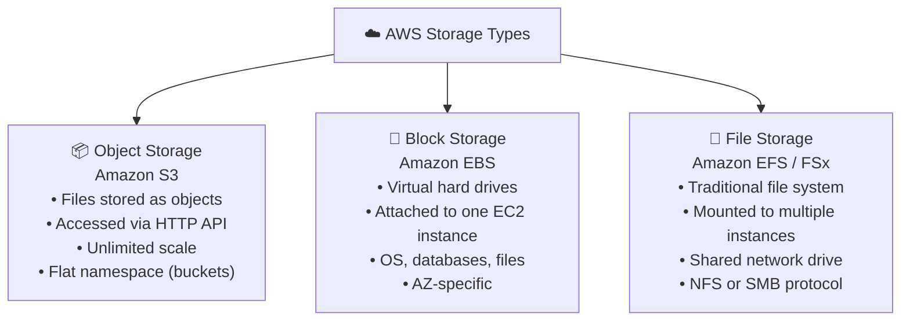
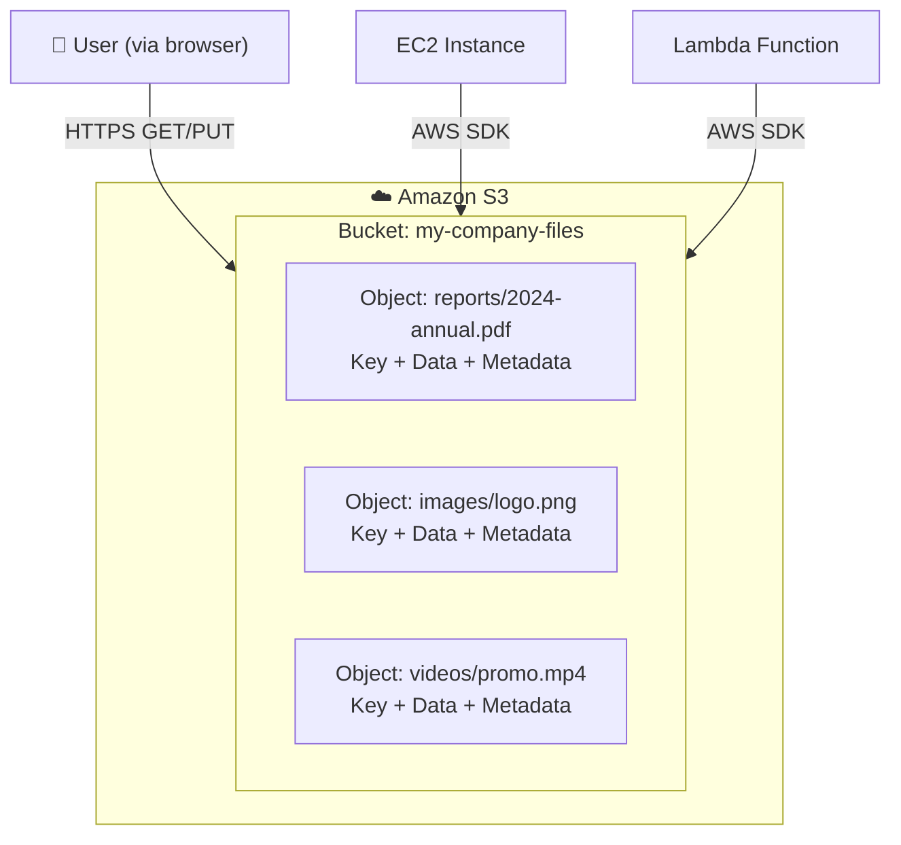
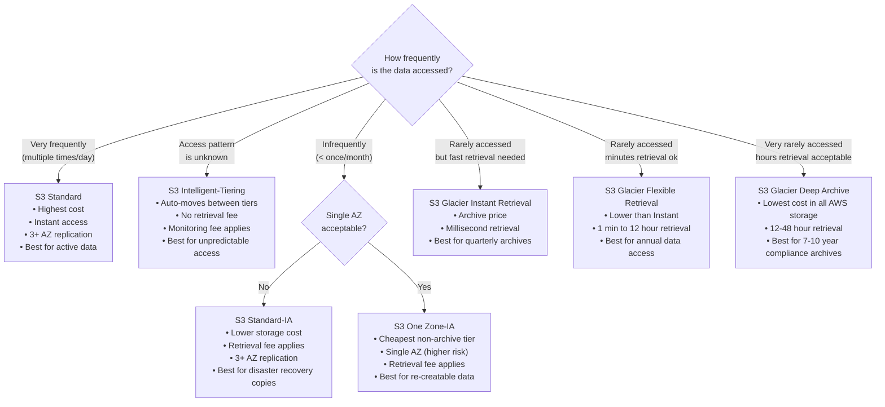
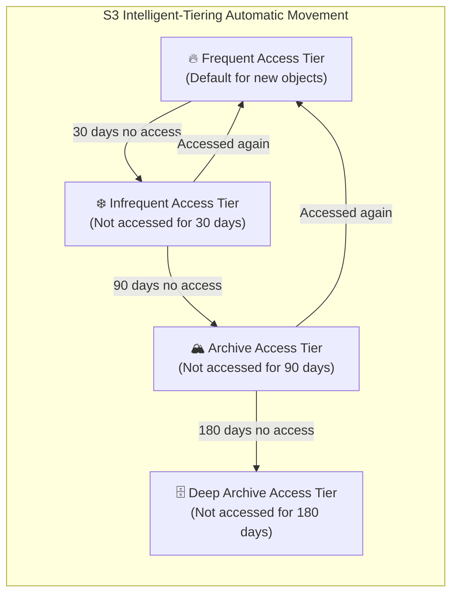
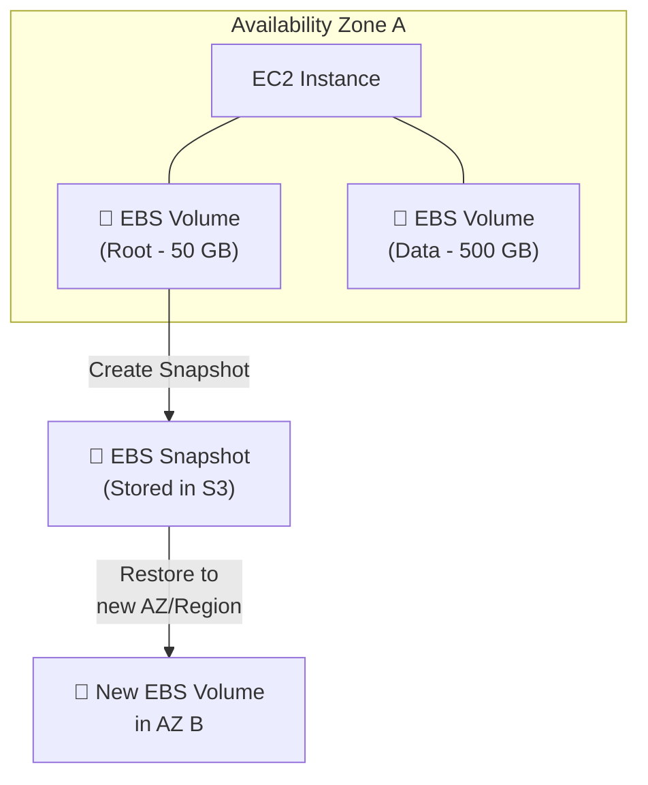
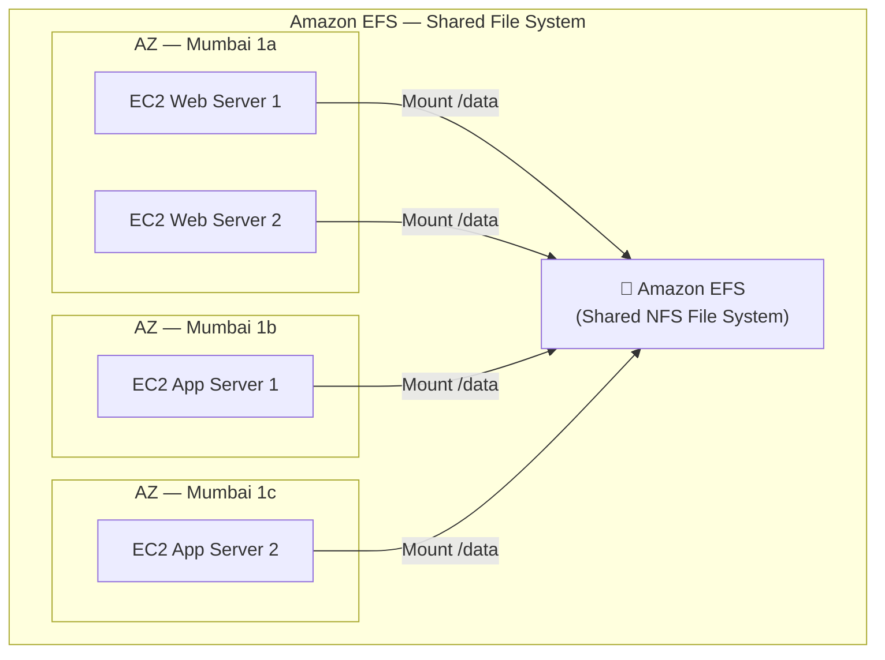
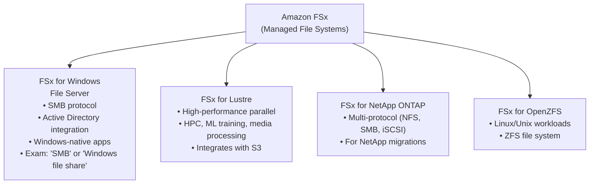
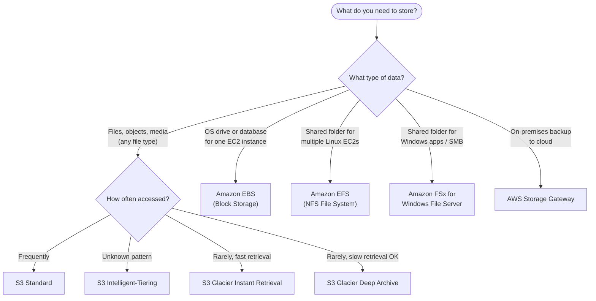

# AWS Storage Services — S3, EBS, EFS & FSx

> **Exam:** AWS Certified Cloud Practitioner (CLF-C02)
> **Domain:** Cloud Technology and Services (34% of exam)
> **Chapter:** 03b — Core Services: Storage
> **Topics:** Amazon S3, S3 Storage Classes, Amazon EBS, Amazon EFS, Amazon FSx, Storage Selection Guide

---

## Learning Objectives

After reading this chapter you will be able to:
- Explain the difference between object storage, block storage, and file storage
- Identify the correct Amazon S3 storage class for a given access pattern and cost requirement
- Distinguish between EBS, EFS, and FSx and choose the right one for a use case
- Describe how S3 durability and availability guarantees work
- Apply S3 Intelligent-Tiering and lifecycle policies to optimise costs

---

## 1. Storage Type Overview

AWS provides three fundamental storage paradigms. Understanding the difference is critical for the exam.



### Storage Type Comparison

| Dimension | Object (S3) | Block (EBS) | File (EFS/FSx) |
|---|---|---|---|
| **Access method** | HTTP/HTTPS API | Attached as device | Mounted via NFS/SMB |
| **Multiple instance access** | ✅ Yes (via API) | ❌ No (one EC2 only) | ✅ Yes (simultaneous) |
| **Typical use** | Media files, backups, static web | OS boot, databases | Shared config, app files |
| **Max capacity** | Virtually unlimited | 64 TB per volume | Petabytes (auto-scales) |
| **AZ constraint** | Regional (cross-AZ) | Single AZ | Multi-AZ (EFS) |

---

## 2. Amazon S3 (Simple Storage Service)

### 2.1 Core Concepts

Amazon S3 is AWS's **object storage service** — a global, highly durable storage for any type of file or data.



### 2.2 S3 Durability and Availability

| Metric | Value | What It Means |
|---|---|---|
| **Durability** | 99.999999999% (11 nines) | Store 10 million objects → lose 1 object every 10,000 years |
| **Availability (Standard)** | 99.99% | < 53 minutes downtime per year |
| **Storage mechanism** | Replicated across minimum 3 AZs | Survives data centre and AZ-level failures |

### 2.3 S3 Key Features

| Feature | Description | Exam Relevance |
|---|---|---|
| **Versioning** | Keep multiple versions of an object | Protects against accidental deletion |
| **Lifecycle Policies** | Auto-transition objects between storage classes | Cost optimisation |
| **Static Website Hosting** | Serve HTML/CSS/JS directly from S3 | No EC2 needed for static sites |
| **Server-Side Encryption** | Encrypt objects at rest automatically | Security requirement |
| **Access Control** | Bucket policies, ACLs, Block Public Access | Control who can read/write |
| **Presigned URLs** | Temporary access URLs for private objects | Share private objects securely |
| **Cross-Region Replication** | Replicate objects to another Region automatically | DR, compliance |
| **Transfer Acceleration** | Faster uploads using CloudFront Edge | Uploading large files globally |

---

## 3. Amazon S3 Storage Classes

This is the most tested S3 topic. Each class is designed for a different **access frequency** and **cost profile**.



### 3.1 Storage Class Comparison Table

```
╔══════════════════════════════╦═══════════╦════════════╦═════════════════════╦═══════════════╗
║ Storage Class                ║ Min Store ║ Retrieval  ║ Availability (AZs)  ║ Best For      ║
╠══════════════════════════════╬═══════════╬════════════╬═════════════════════╬═══════════════╣
║ S3 Standard                  ║ None      ║ Instant    ║ 3+ AZs              ║ Active data   ║
║ S3 Intelligent-Tiering       ║ None      ║ Instant/   ║ 3+ AZs              ║ Unknown       ║
║                              ║           ║ Arch delay ║                     ║ access pattern║
║ S3 Standard-IA               ║ 30 days   ║ Instant    ║ 3+ AZs              ║ DR copies,    ║
║                              ║           ║ (fee)      ║                     ║ backups       ║
║ S3 One Zone-IA               ║ 30 days   ║ Instant    ║ 1 AZ only           ║ Re-creatable  ║
║                              ║           ║ (fee)      ║                     ║ data          ║
║ S3 Glacier Instant Retrieval ║ 90 days   ║ Millisecs  ║ 3+ AZs              ║ Quarterly     ║
║                              ║           ║            ║                     ║ archives      ║
║ S3 Glacier Flexible Retrieval║ 90 days   ║ 1min–12hr  ║ 3+ AZs              ║ Annual access ║
║ S3 Glacier Deep Archive      ║ 180 days  ║ 12–48 hrs  ║ 3+ AZs              ║ 7–10yr        ║
║                              ║           ║            ║                     ║ compliance    ║
╚══════════════════════════════╩═══════════╩════════════╩═════════════════════╩═══════════════╝
```

### 3.2 S3 Intelligent-Tiering — How It Works



**Key Benefit:** No manual lifecycle rule configuration. No performance impact when transitioning. No retrieval fee between tiers within Intelligent-Tiering.

---

## 4. Amazon EBS (Elastic Block Store)

### 4.1 What Is EBS?

EBS provides **persistent block-level storage volumes** that can be attached to EC2 instances. Think of it as a virtual SSD or HDD that persists independently of the EC2 instance lifecycle.



### 4.2 EBS Key Properties

| Property | Detail |
|---|---|
| **Attachment** | Single EC2 instance at a time (in same AZ) |
| **Persistence** | Data persists even after EC2 instance stop/terminate (configurable) |
| **AZ binding** | EBS volume is locked to the AZ where created |
| **Snapshots** | Point-in-time backups stored in S3, can copy to other Regions |
| **Encryption** | AES-256 encryption at rest and in transit |
| **Performance** | SSD-backed (gp3, io2) or HDD-backed (st1, sc1) |

### 4.3 EBS Volume Types

| Type | Class | Use Case | Max IOPS |
|---|---|---|---|
| **gp3** (General Purpose SSD) | SSD | Most workloads, boot volumes, dev | 16,000 |
| **io2** (Provisioned IOPS SSD) | SSD | Databases, critical apps needing consistent high IOPS | 256,000 |
| **st1** (Throughput HDD) | HDD | Big data, log processing, sequential reads | 500 MB/s |
| **sc1** (Cold HDD) | HDD | Infrequently accessed, lowest EBS cost | 250 MB/s |

**Exam Tip:** CCP exam does not test specific EBS type names. Know that EBS is block storage for EC2, it binds to one AZ, and snapshots can move data between AZs.

---

## 5. Amazon EFS (Elastic File System)

### 5.1 What Is EFS?

EFS provides a **fully managed, scalable, shared file system** (using NFS protocol) that multiple Linux EC2 instances can mount simultaneously.



### 5.2 EFS Key Properties

| Property | Detail |
|---|---|
| **Access** | Multiple EC2 instances simultaneously (across AZs) |
| **Protocol** | NFS (Network File System) — Linux only |
| **Scaling** | Automatically grows and shrinks — no pre-provisioning |
| **Durability** | Multi-AZ — data replicated across multiple AZs |
| **Performance modes** | General Purpose, Max I/O |
| **Throughput modes** | Bursting, Provisioned, Elastic |
| **Storage classes** | Standard (frequently accessed), Infrequent Access (lower cost) |

---

## 6. Amazon FSx

### 6.1 What Is FSx?

Amazon FSx provides **fully managed third-party file systems** on AWS. It is designed for workloads that require specific file system protocols beyond what EFS provides.

### 6.2 FSx Variants



### 6.3 FSx for Windows File Server — Exam Focus

| Property | Detail |
|---|---|
| **Protocol** | SMB (Server Message Block) |
| **OS support** | Windows instances primarily |
| **Active Directory** | Natively integrates with Windows AD |
| **Use case** | Windows applications that need shared file storage |
| **Exam keyword** | Any question mentioning **SMB protocol** or **Windows file share** |

---

## 7. AWS Storage Gateway

Storage Gateway connects on-premises environments to AWS cloud storage.

| Gateway Type | What It Does | Use Case |
|---|---|---|
| **File Gateway** | On-premises NFS/SMB access backed by S3 | Migrate file data to S3 |
| **Volume Gateway** | Block storage backed by S3 (via iSCSI) | Cloud-backed on-premises volumes |
| **Tape Gateway** | Virtual tape library backed by Glacier | Replace physical tape backup |

---

## 8. Storage Selection Decision Guide



---

## 9. Complete Storage Comparison

```
╔══════════════════╦═══════════════╦═══════════════╦═══════════════╦═══════════════╗
║    Feature       ║    S3         ║    EBS        ║    EFS        ║    FSx        ║
╠══════════════════╬═══════════════╬═══════════════╬═══════════════╬═══════════════╣
║ Storage type     ║ Object        ║ Block         ║ File (NFS)    ║ File (SMB/NFS)║
║ Multi-instance   ║ Via API       ║ No (1 EC2)    ║ Yes (Linux)   ║ Yes (Windows) ║
║ Scales auto      ║ Unlimited     ║ Manual resize ║ Auto          ║ Auto          ║
║ AZ scope         ║ Regional      ║ Single AZ     ║ Multi-AZ      ║ Multi-AZ      ║
║ Protocol         ║ HTTPS (REST)  ║ Block device  ║ NFS           ║ SMB / NFS     ║
║ OS               ║ Any           ║ Any           ║ Linux         ║ Windows/Linux ║
║ Durability       ║ 11 nines      ║ 99.8%-99.9%   ║ Multi-AZ      ║ Multi-AZ      ║
╚══════════════════╩═══════════════╩═══════════════╩═══════════════╩═══════════════╝
```

---

## 10. Exam Focus Points

| Scenario | Correct Answer |
|---|---|
| "Store logs for 7 years, rarely accessed, cheapest possible" | S3 Glacier Deep Archive |
| "Archive data accessed once per quarter, need millisecond retrieval" | S3 Glacier Instant Retrieval |
| "Unknown access pattern, auto cost optimisation" | S3 Intelligent-Tiering |
| "Block storage for a single EC2 database server" | Amazon EBS |
| "Shared storage mounted by 10 Linux EC2 instances" | Amazon EFS |
| "Windows application needing SMB file shares on AWS" | Amazon FSx for Windows File Server |
| "Static website hosting without EC2" | Amazon S3 (static website hosting) |
| "On-premises backup directly to AWS cloud storage" | AWS Storage Gateway |
| "Move EBS volume from one AZ to another" | Create EBS Snapshot, restore in target AZ |

---

## 11. Exam Traps

| Trap | Correct Understanding |
|---|---|
| "EBS can be attached to multiple EC2 instances" | ❌ False. EBS attaches to **one** EC2 instance at a time (in same AZ) |
| "EFS works with Windows instances" | ❌ Primarily designed for Linux. Use FSx for Windows. |
| "S3 Glacier Instant = slow retrieval" | ❌ False. **Instant** means millisecond retrieval, like Standard-IA |
| "S3 One Zone-IA = cheapest archive" | ❌ False. Glacier Deep Archive is cheapest. One Zone-IA is cheaper than Standard-IA but not an archive tier |
| "EFS auto-scales but must be pre-sized" | ❌ False. EFS automatically scales up and down with no capacity planning |

---

## 12. Quick Revision Points

- **S3** = object storage, HTTP access, unlimited scale, 11-nine durability, Regional
- **S3 Standard** = frequent access; **Intelligent-Tiering** = auto-cost; **Glacier Instant** = rare but fast; **Deep Archive** = cheapest, 12-48hr retrieval
- **S3 Lifecycle policies** = automatically move objects between storage classes
- **EBS** = block storage, one EC2 only, same AZ, persistent, virtual hard drive
- **EFS** = shared file system, multiple Linux EC2s, auto-scales, multi-AZ
- **FSx for Windows** = SMB protocol, Windows AD integration, shared Windows file system
- **S3 durability** = 99.999999999% (11 nines) across 3+ AZs
- **EBS Snapshot** = point-in-time backup stored in S3; can copy across Regions
- **Storage Gateway** = connects on-premises to AWS cloud storage

---

*Previous Chapter → `03-core-services/compute/ec2-basics.md`*
*Next Chapter → `03-core-services/database/rds-vs-dynamodb.md`*
