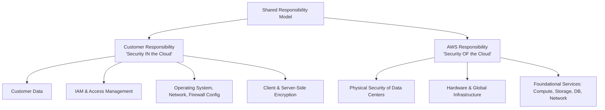
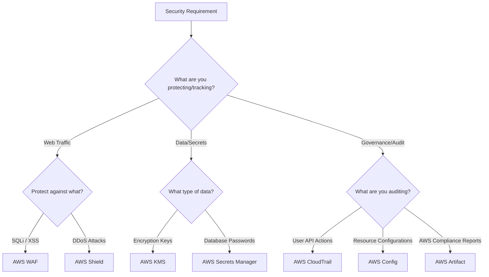

# Security and Compliance: Shared Responsibility & IAM

> **Exam:** AWS Certified Cloud Practitioner (CLF-C02)
> **Domain:** 2.0 Security and Compliance
> **Weight:** 30%
> **Difficulty:** Intermediate
> **Last Updated:** 2026-06

---

## 🎯 Learning Objectives
After reading this chapter, you will be able to:
1. Clearly define the AWS Shared Responsibility Model.
2. Understand AWS Identity and Access Management (IAM) components.
3. Differentiate between AWS WAF, AWS Shield, and AWS KMS.
4. Identify compliance and monitoring services like AWS CloudTrail, AWS Config, and AWS Artifact.

---

## 🏛️ Architecture Overview: The Shared Responsibility Model

The fundamental security concept in AWS is the **Shared Responsibility Model**. It dictates who is responsible for what.

---

## 📘 Concept Definitions

### 1. IAM (Identity and Access Management)
A global service used to manage access to AWS services and resources securely.
- **Users:** Individuals or applications.
- **Groups:** Collections of users with identical permissions.
- **Roles:** Temporary credentials assumed by trusted entities (like EC2 instances or Lambda functions).
- **Policies:** JSON documents that define permissions (Allow/Deny).

### 2. Network & Application Protection
- **AWS WAF (Web Application Firewall):** Protects web applications from common web exploits (e.g., SQL injection, Cross-Site Scripting). Operates at Layer 7.
- **AWS Shield:** A managed Distributed Denial of Service (DDoS) protection service.
  - *Shield Standard:* Free, protects against common network/transport layer attacks.
  - *Shield Advanced:* Paid, provides enhanced protection and access to the DDoS Response Team.

### 3. Data Security & Cryptography
- **AWS KMS (Key Management Service):** Creates and manages cryptographic keys to encrypt your data.
- **AWS CloudHSM:** Cloud-based hardware security module that enables you to easily generate and use your own encryption keys.
- **AWS Secrets Manager:** Protects secrets needed to access your applications, services, and IT resources (e.g., database credentials).

### 4. Visibility & Compliance
- **AWS CloudTrail:** Logs all API calls made within your AWS account. It answers "Who did what, when, and from where?"
- **AWS Config:** Assesses, audits, and evaluates the configurations of your AWS resources against desired compliance rules.
- **AWS Artifact:** Your go-to central resource for compliance-related information. Provides access to AWS security and compliance reports (e.g., ISO, SOC, PCI reports).
- **AWS Security Hub:** A centralized view of your security alerts and compliance status across your AWS accounts.

---

## ⚖️ Service Comparison Matrix

| Service | Primary Function | Layer / Scope | What it Answers |
|---------|------------------|---------------|-----------------|
| **AWS WAF** | Web exploit protection | Layer 7 (Application) | "Is this HTTP request malicious?" |
| **AWS Shield** | DDoS protection | Layer 3/4 (Network/Transport) | "Is this a flood of fake traffic?" |
| **CloudTrail** | API Activity Logging | Account-wide | "Who invoked this API call?" |
| **AWS Config** | Resource Configuration | Account-wide | "Is my S3 bucket currently public?" |
| **AWS Artifact** | Compliance Documentation| AWS Corporate Level | "Is AWS SOC-2 compliant?" |

---

## 🗺️ Decision Guide: Security Services

---

## ⚡ Exam Focus Points

- ✅ **Shared Responsibility:** AWS is responsible for physical host security and infrastructure. YOU are responsible for guest OS patching, data encryption, and firewall rules (Security Groups).
- ✅ **CloudTrail vs Config:** CloudTrail tracks **actions** (API calls). Config tracks **states** (configuration history and rule compliance).
- ✅ **IAM Roles:** Use roles for assigning permissions to AWS services (e.g., giving an EC2 instance access to an S3 bucket), NOT access keys.
- ✅ **WAF vs Shield:** WAF is for Application Layer (SQL injection, XSS). Shield is for Infrastructure/Network Layer (DDoS mitigation).
- ✅ **AWS Artifact:** If the question mentions downloading SOC or ISO compliance reports, the answer is AWS Artifact.

---

## 📝 Quick Revision
- **Security IN the Cloud:** Customer responsibility (Data, OS, IAM).
- **Security OF the Cloud:** AWS responsibility (Hardware, Data Centers).
- **IAM:** Users, Groups, Roles, Policies.
- **WAF:** Web Application Firewall (Layer 7).
- **Shield:** DDoS protection.
- **CloudTrail:** API logs (Who did what).
- **Config:** Configuration tracking.
- **Artifact:** Compliance reports.
- **KMS:** Encryption key management.
