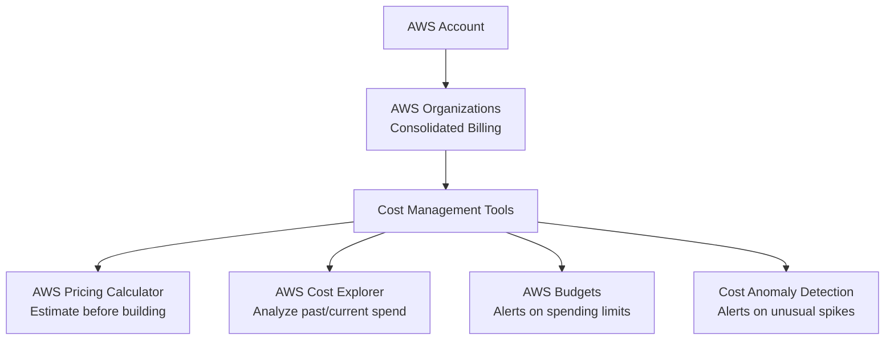
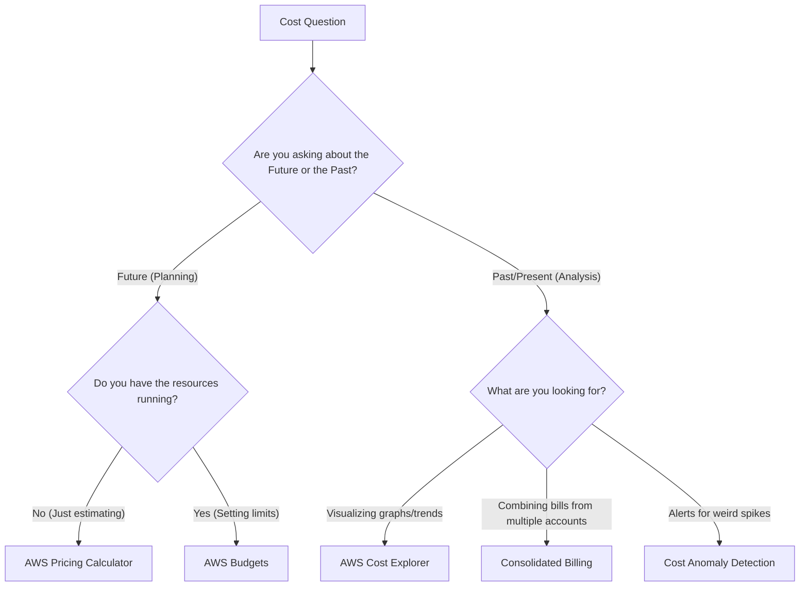

# Billing, Pricing, and Support: Cost Optimization

> **Exam:** AWS Certified Cloud Practitioner (CLF-C02)
> **Domain:** 4.0 Billing, Pricing, and Support
> **Weight:** 12%
> **Difficulty:** Beginner
> **Last Updated:** 2026-06

---

## 🎯 Learning Objectives
After reading this chapter, you will be able to:
1. Understand AWS pricing fundamentals and total cost of ownership (TCO).
2. Differentiate between AWS billing tools (Cost Explorer, Budgets, Pricing Calculator).
3. Identify the different AWS Support Plans and their features.
4. Apply the concept of AWS Organizations for consolidated billing.

---

## 🏛️ Architecture Overview: AWS Billing & Cost Management

---

## 📘 Concept Definitions

### 1. AWS Pricing Fundamentals
AWS follows three fundamental drivers of cost:
- **Compute:** Pay per hour/second of usage.
- **Storage:** Pay per GB stored.
- **Data Transfer:** Data flowing *INTO* AWS is free. Data flowing *OUT* of AWS (to the internet) is charged.

### 2. AWS Organizations and Consolidated Billing
AWS Organizations allows you to centrally manage multiple AWS accounts.
- **Consolidated Billing:** Combines billing for all accounts into a single invoice.
- **Volume Discounts:** The combined usage of all accounts helps you reach lower price tiers faster.

### 3. AWS Cost Explorer
A tool that lets you visualize, understand, and manage your AWS costs and usage over time.
- **Use Case:** "Why was my AWS bill so high last month?" or "Show me a graph of EC2 spending over the last 6 months."
- **Forecasting:** Can predict costs for the next 12 months based on past usage.

### 4. AWS Budgets
A tool to set custom budgets that alert you when your costs or usage exceed (or are forecasted to exceed) your budgeted amount.
- **Use Case:** "Email me if my monthly bill goes over $100."

### 5. AWS Pricing Calculator
A web-based planning tool to estimate the cost of AWS services before you actually build them.
- **Use Case:** "How much would it cost to run 5 EC2 instances and 1 RDS database next year?"

### 6. TCO (Total Cost of Ownership)
A financial estimate that helps you compare the cost of running an on-premises data center vs. moving to AWS. It factors in hardware, software, power, cooling, and IT staff.

---

## ⚖️ Service Comparison Matrix: Support Plans

| Feature | Developer | Business | Enterprise On-Ramp | Enterprise |
|---------|-----------|----------|--------------------|------------|
| **Response Time** | 12-24 hours | 1 hour (system down) | 30 mins (critical) | 15 mins (critical) |
| **Tech Support** | Business hours email | 24x7 phone, email, chat | 24x7 phone, email, chat | 24x7 phone, email, chat |
| **TAM Access** | No | No | Pool of TAMs | Dedicated TAM |
| **Trusted Advisor**| Core checks only | All checks | All checks | All checks |
| **Target Audience**| Early development | Production workloads | Growing production | Mission-critical apps |

*Note: TAM = Technical Account Manager*

---

## 🗺️ Decision Guide: Which Tool to Use?

---

## ⚡ Exam Focus Points

- ✅ **Data Transfer:** Remember the rule: IN is Free, OUT is Fee. Moving data *into* S3 is free. Downloading data *from* S3 to the internet costs money.
- ✅ **Cost Explorer vs Pricing Calculator:** If you haven't built it yet, use the **Pricing Calculator**. If you already built it and want to see graphs of your spend, use **Cost Explorer**.
- ✅ **Budgets:** If the question mentions getting an email/SNS notification when spending hits a certain limit, it's **AWS Budgets**.
- ✅ **Support Plans:** If the question mentions needing a **Technical Account Manager (TAM)**, the answer is either **Enterprise** or **Enterprise On-Ramp** support. If it mentions 15-minute response times for business-critical system down, it's Enterprise.
- ✅ **Consolidated Billing:** Provides one bill for multiple accounts and gives volume discounts across the entire organization.

---

## 📝 Quick Revision
- **Pricing Calculator:** Estimate costs before building.
- **Cost Explorer:** View graphs of past spending and forecast future spending.
- **Budgets:** Set spending limits and alerts.
- **Organizations:** Consolidated billing for volume discounts.
- **Enterprise Support:** Includes a dedicated TAM and 15-minute response time.
