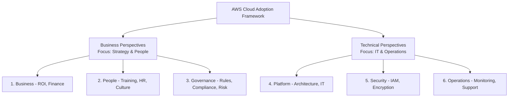
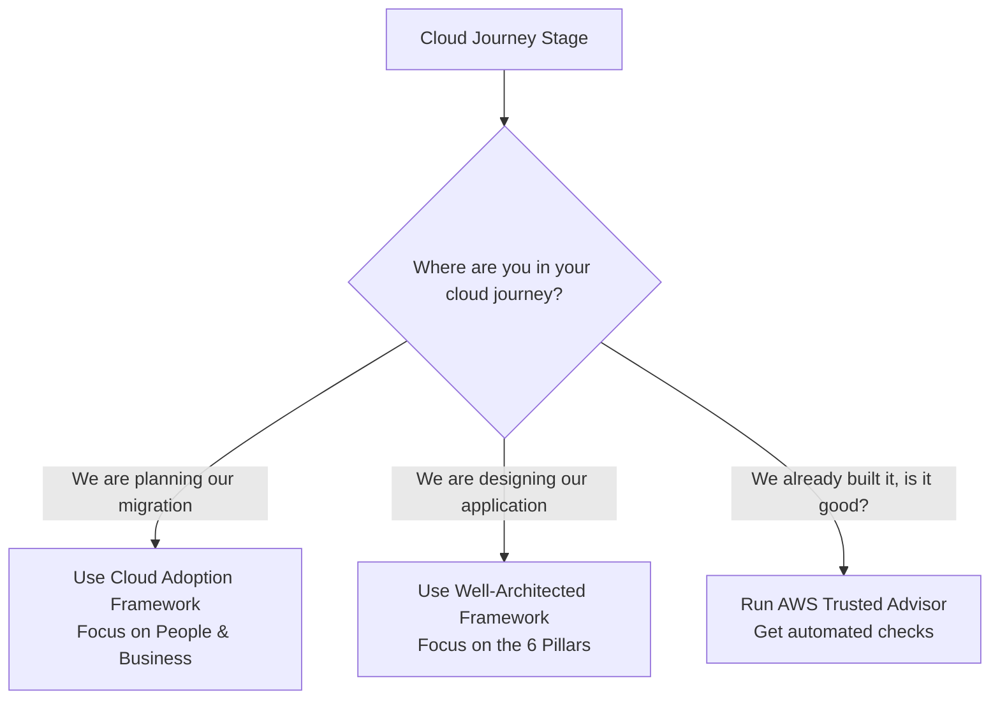

# AWS Cloud Adoption Framework & Well-Architected

> **Exam:** AWS Certified Cloud Practitioner (CLF-C02)
> **Domain:** 1.0 Cloud Concepts (and 3.0 Cloud Technology)
> **Weight:** Combined
> **Difficulty:** Intermediate
> **Last Updated:** 2026-06

---

## 🎯 Learning Objectives
After reading this chapter, you will be able to:
1. Explain the 6 perspectives of the AWS Cloud Adoption Framework (CAF).
2. Understand the 6 pillars of the AWS Well-Architected Framework.
3. Use the AWS Trusted Advisor tool to optimize your AWS environment.

---

## 🏛️ Concept 1: AWS Cloud Adoption Framework (CAF)

The AWS CAF helps organizations plan a successful migration to the cloud. It groups guidance into 6 areas of focus, called **Perspectives**.

### The 6 CAF Perspectives Explained
- **Business:** Ensures cloud investments align with business goals (ROI, IT finance).
- **People:** Focuses on training, staffing, HR, and organizational culture changes.
- **Governance:** Focuses on skills, processes, and rules to maximize business value and minimize risk.
- **Platform:** Focuses on designing, building, and optimizing cloud architecture (IT teams).
- **Security:** Ensures the organization meets security objectives for visibility, auditability, and control.
- **Operations:** Focuses on operating and recovering IT workloads to meet the needs of business stakeholders.

---

## 🏛️ Concept 2: AWS Well-Architected Framework

Once you are in the cloud, how do you know if your architecture is "good"? The Well-Architected Framework provides 6 pillars for designing secure, high-performing, resilient, and efficient infrastructure.

### The 6 Pillars

| Pillar | Focus | Key Question |
|--------|-------|--------------|
| **1. Operational Excellence** | Running and monitoring systems to deliver business value | Are you automating operations and learning from failures? |
| **2. Security** | Protecting information, systems, and assets | Are you encrypting data and using least privilege access? |
| **3. Reliability** | Recovering from failures quickly and automatically | Can your system survive an Availability Zone outage? |
| **4. Performance Efficiency** | Using computing resources efficiently | Are you using the right EC2 instance types for your workload? |
| **5. Cost Optimization** | Avoiding unnecessary costs | Are you turning off unused servers and using savings plans? |
| **6. Sustainability** | Minimizing the environmental impacts of running cloud workloads | Are you maximizing utilization to reduce your carbon footprint? |

---

## 🛠️ Tool: AWS Trusted Advisor

AWS Trusted Advisor is an online tool that acts like your customized cloud expert, analyzing your AWS environment and providing best practice recommendations.

It evaluates your account against 5 categories:
1. **Cost Optimization:** Finds unused resources (e.g., idle EC2 instances or unattached EBS volumes).
2. **Performance:** Checks service limits and throughput.
3. **Security:** Checks for open ports (like SSH open to the world) and unencrypted S3 buckets.
4. **Fault Tolerance:** Checks if you are using Auto Scaling and multiple AZs.
5. **Service Limits:** Warns you if you are close to hitting account limits.

---

## 🗺️ Decision Guide: CAF vs Well-Architected vs Trusted Advisor

---

## ⚡ Exam Focus Points

- ✅ **CAF vs Well-Architected:** CAF is for **organizational transformation** (moving the company to the cloud). Well-Architected is for **technical design** (building an app in the cloud).
- ✅ **CAF Perspectives:** If a question mentions "HR", "Training", or "Staffing", the answer is the **People Perspective** of CAF.
- ✅ **Trusted Advisor:** If you need an automated tool to check if you have open Security Groups, idle EC2 instances, or unencrypted data, use **AWS Trusted Advisor**.
- ✅ **Sustainability:** The newest pillar of the Well-Architected Framework. It focuses on energy consumption and carbon footprint.

---

## 📝 Quick Revision
- **CAF (6 Perspectives):** Business, People, Governance, Platform, Security, Operations.
- **Well-Architected (6 Pillars):** Operational Excellence, Security, Reliability, Performance Efficiency, Cost Optimization, Sustainability.
- **Trusted Advisor:** Automated checks for Cost, Performance, Security, Fault Tolerance, and Limits.
